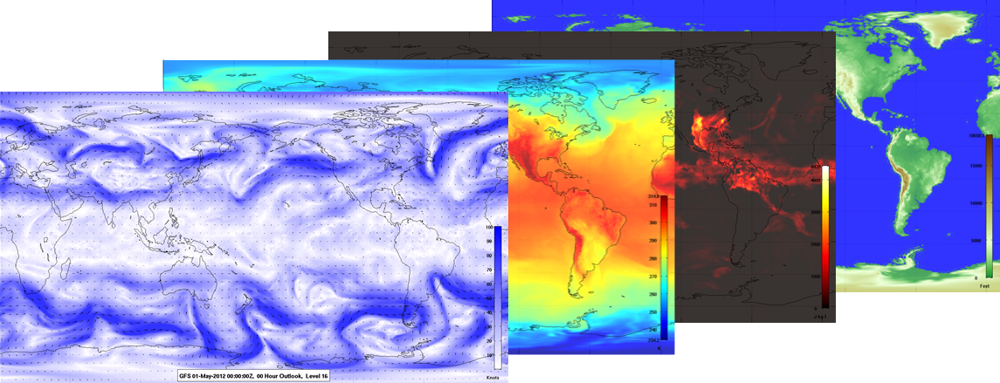

Atmospheric Toolbox
===========

The Atmospheric Toolbox contains methods for accessing, analyzing, and visualizing atmospheric data.

Large datasets, complex data formats, and incompatible tools can make atmospheric analysis complicated. This toolbox addresses these challenges.

### Supported Datasets

* Rapid Refresh (RAP)
* Rapid Update Cycle (RUC)
* Global Forecast System (GFS)
* Aircraft Measurements (AMDAR)

#### Prerequisites

* Matlab 2008a or newer
* Java 6

#### LICENSE

Copyright 2013, The MITRE Corporation. [Licensed under Apache 2.0](LICENSE.md)

